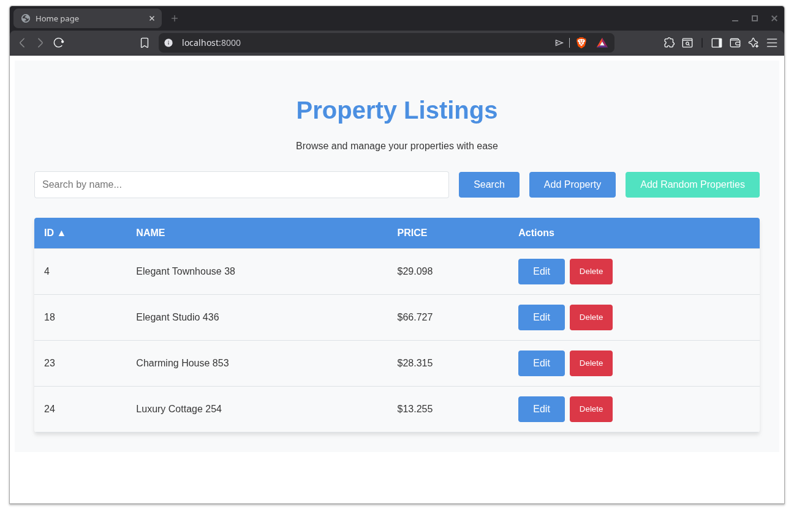

# Haya Project

This is a modern Symfony and Vue.js web application. It uses Webpack Encore with Vue 3 and Stimulus for the frontend.



## Requirements
- Docker and Docker Compose (V2 recommended)

## Setup and Installation

The project is fully dockerized. To start the application and install all necessary dependencies (Composer, NPM, building assets, and running database migrations), simply use the provided `Makefile`:

```bash
make install
```

For subsequent runs, you can just start the containers in the background:

```bash
make up
```

To stop the containers:

```bash
make down
```

## Available Commands

A `Makefile` is provided to simplify common tasks. Run `make help` to see a list of all commands:

- `make up` - Start containers in the background
- `make down` - Stop all running containers
- `make build` - Build the Docker images
- `make install` - Set up the project from scratch (installs dependencies, builds assets, migrates DB)
- `make bash` - Open an interactive bash shell inside the PHP container
- `make logs` - Tail the logs from the running containers

## Accessing the Application

Once the containers are running, you can access the application through your browser:

- **Home page:** [http://localhost:8000/](http://localhost:8000/)

## Environment Variables

The project configuration is managed via `.env`. A default `.env` is committed. Note that the `DATABASE_URL` is configured to connect to the internal `database` Docker container automatically when running via `docker-compose`.

If you need to change database credentials, update them in your `.env` or create a `.env.local`:
```
MYSQL_ROOT_PASSWORD=root
MYSQL_DATABASE=haya
MYSQL_USER=victor
MYSQL_PASSWORD=tincpad
```

## Tech Stack
- PHP 8.1
- Symfony 6.1
- Vue.js 3
- MySQL 8.0
- Nginx
